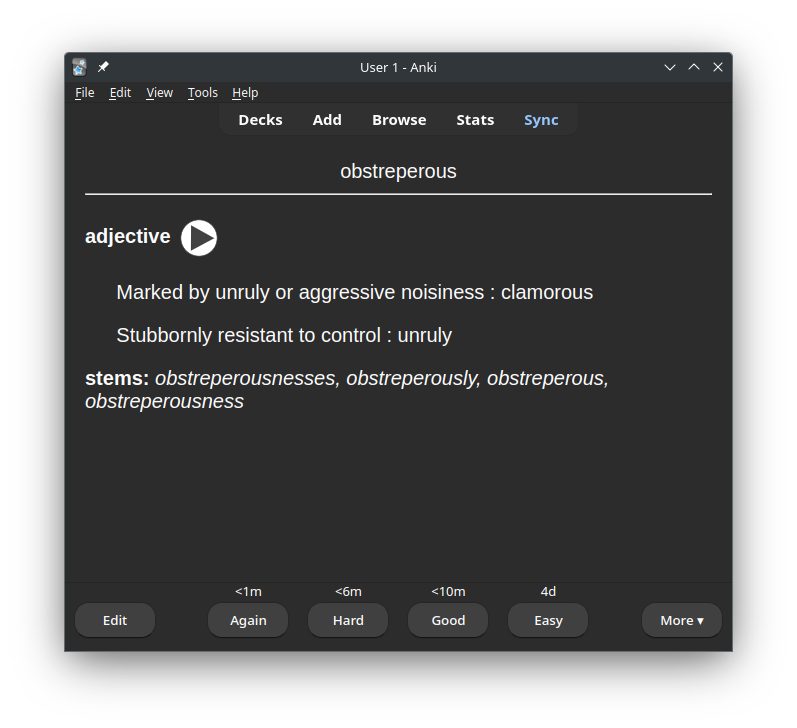

## kobo-to-anki

Automate the creation of Anki flashcards from the saved words stored in your Kobo ereader

### How does it work?

Assuming you have already enabled the beta feature **My Words**. If you have not or would like to, here is a [link](https://goodereader.com/blog/kobo-ereader-news/kobo-e-readers-now-save-words-you-looked-up-in-the-dictionary)

Enabling the [developer option](https://goodereader.com/blog/kobo-ereader-news/how-to-access-the-secret-kobo-developer-options) on the Kobo ereader provides a variety of things, but the feature I am most interested in is FTP (File Transfer Protocol). We use FTP to copy the **KoboReader.sqlite** database from the ereader. Within this database there is a table, **WordList**, which stores the saved words. An api call is made to Merriam Webster to retrieve the word stems, definition and pronunciation if available. An api call is only made if a flashcard has not been created for that word.

**_Note:_**

- By default there is no password for root or the ftp user! Assess your threat model if you are concerned!

- When you save a word this does not update the **WordList** table. Through my testing it will only update if you do one of the following:

    - Turn the device off and on

    - Mount the device on a computer and then eject

### Project file locations

A path (**/home/username/.kobo-to-anki/**) is created which stores the following:
- KoboReader.sqlite
- Anki.sqlite

The first database is copy of what is on the ereader which is overwritten each time the script is executed. The second database will contain the words for which the flashcards have been created along with the word stems. Currently, the script creates flashcards for the **Head Word** (Company) and ignores the **Stems** (Companies, Companied, Companying). 

### Example of flashcard


## Getting Started

### Requirements

- [Python 3.x](https://www.python.org/downloads/)

- [PIP](https://pip.pypa.io/en/stable/installation/)

- [git](https://git-scm.com/book/en/v2/Getting-Started-Installing-Git) (recommended)

### Installation

1. Install the [anki-connect](https://github.com/FooSoft/anki-connect) add-on

2. Create a [merriam webster account](https://dictionaryapi.com/register/index). You want to ensure one out of the two api key requested is **Collegiate Dictionary**. You should then be able to login and see your api key

3. Obtain the IP address of your ereader
    
    Go to your **Home** screen on your ereader

    Tap the **More** icon at the bottom of the screen

    Tap **Settings**

    Tap **Device Information**

    You will now see the IP address of your ereader
    
    Make a note of this for later use

4. Run the following in your shell to install the project and dependencies:

    ```sh
    git clone https://github.com/WhoKanICan/kobo-to-anki.git
    cd kobo-to-anki
    pip install -r requirements.txt
    ```

    To install without git, download the source code from GitHub, extract the archive, and follow the steps above beginning from the second line.

5.  Setting environment variables
    
    While you are still in the kobo-to-anki directory issue the following commands in your shell

    - replace <API_KEY> with the key you requested from step 2

    - replace <IP_ADDRESS> with the IP address from step 3

    ```sh
    echo  "export MERRIAM_KEY=<API_KEY>" >> ~/.zshrc
    echo  "export KOBO_IP_ADDRESS=<IP_ADDRESS>" >> ~/.zshrc
    echo  "export KOBO_TO_ANKI_PATH=${PWD}" >> ~/.zshrc
    source ~/.zshrc
    ```

    If you are using any other shell then replace ~/.zshrc accordingly

### Executing program

Within the kobo-to-anki directory you issue
```python
python main.py
```
Once the flashcards have been created, Anki will be automatically synced and exited

### Uninstall
You can remove the kobo-to-anki directory that stores the two .sqlite databases and delete the project downloaded

 ## TODO
- [ ] Change method for retrieval of KoboReader.sqlite (security reasons)
- [ ] Provide option to work via usb